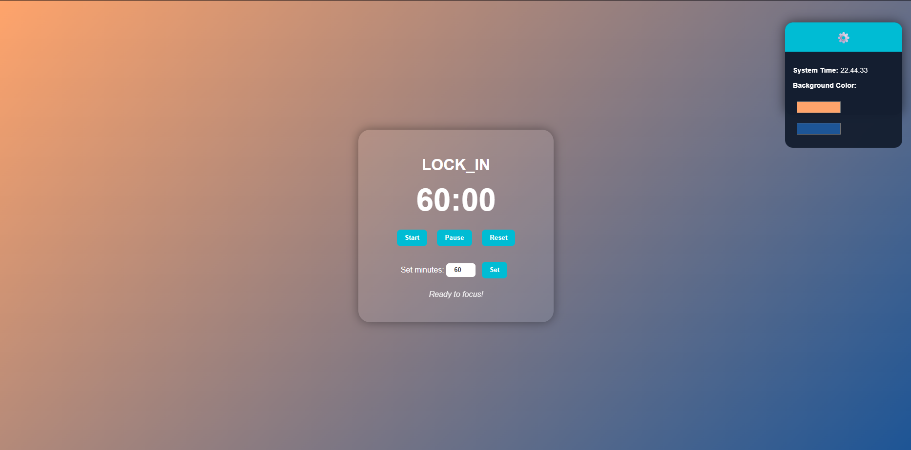

# 🕹️ LOCK_IN — Focus Timer & Customizable Dashboard

A simple, distraction-free **focus timer** built with **HTML, CSS, and JavaScript**.  
LOCK_IN helps you stay productive by timing your work sessions and letting you personalize the background with your favorite gradient colors — all while running completely offline. Project I worked on during the dreaded mocks in Febuary of this year, added the hover function to the widget over the past few days since im **bored**  

---

## ✨ Features
- ⏳ **Pomodoro-style focus timer** with Start, Pause, and Reset controls  
- 🎨 **Custom gradient background** using color pickers  
- 💾 **Saves your color preferences** with `localStorage`  
- 🕒 **Live system clock widget**  
- ⚙️ **Collapsible widget** (expands smoothly on hover)  
- 💡 **100% offline** — no APIs, no dependencies, no frameworks  

---

## 🧠 Tech Stack
- **HTML5** – structure  
- **CSS3** – layout, gradients, animations  
- **JavaScript (ES6)** – timer logic & interactivity  
- **localStorage** – to remember your color settings  

---

## 🖼️ Preview


> *LOCK_IN expands its settings widget when hovered — revealing the live clock and color customization tools.*

---

## ⚙️ Setup

1. Clone or download the repository:
   ```bash
   git clone https://github.com/YOUR-USERNAME/LOCK_IN.git
   ```

2. Open the project folder:
   ```bash
   cd LOCK_IN
   ```

3. Launch it by opening **index.html** in your browser.  
   *(No installation or server needed — it runs locally.)*

---

## 💡 How It Works
- The main focus timer uses `setInterval()` to count down time.  
- The color pickers modify the body’s gradient using `linear-gradient()`.  
- Selected colors are saved in `localStorage` and reloaded automatically next time you open the app.  
- The top-right widget displays the system clock, updates every second, and expands smoothly on hover.  


---

## 🧑‍💻 Author
**Raghib Haque**  
Immersive Software Engineering (ISE), University of Limerick  
> *“Stay focused. Lock in.” 🔒*

---

## 📜 License
This project is released under the **MIT License** — feel free to fork, modify, and build on it.
